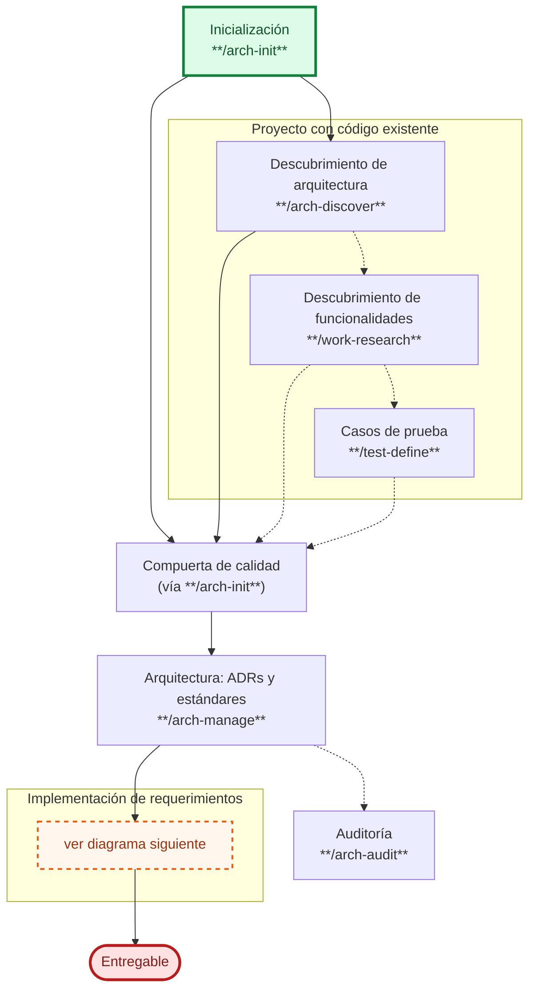
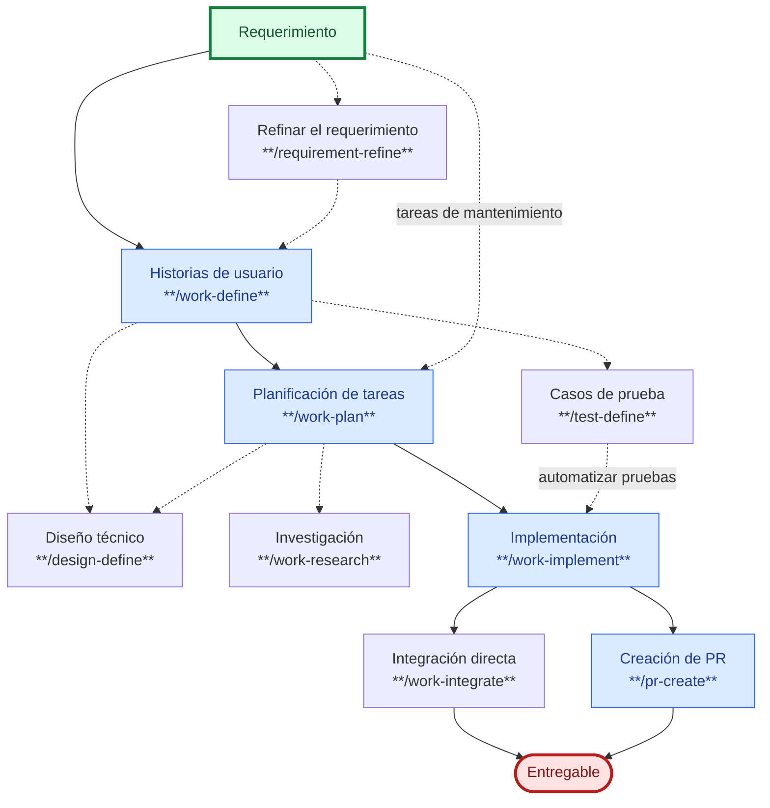
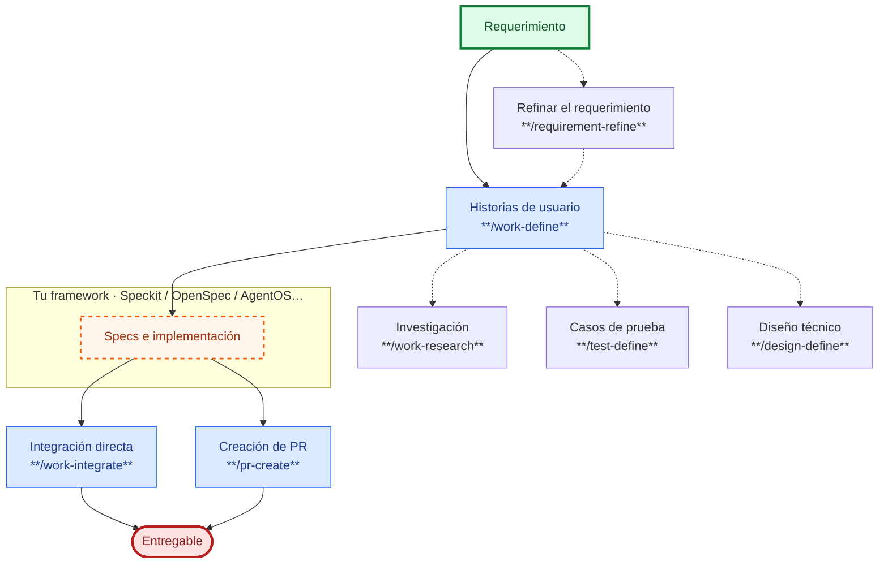

# SDD Devkit


**SDD Devkit** es un plugin de Spec-Driven Development: convierte un requerimiento en documentación (historias de usuario, decisiones de arquitectura, diseño técnico, casos de prueba) y te acompaña hasta un entregable verificado. Incluye skills para:

- Documentar arquitectura (ADRs, estándares) y auditar su cumplimiento.
- Crear historias de usuario, planificar e implementar tareas.
- Definir y trazar casos de prueba.
- Investigar producto, arquitectura o aspectos técnicos.
- Revisar código, integrar cambios y crear Pull Requests con puertas de calidad.


## Instalación

Instala el plugin completo, no skills sueltos. Es compatible con cualquier agente que soporte el estándar abierto [Agent Plugins](https://agent-plugins.org/), entre ellos:

**Cursor:**

```
/add-plugin https://github.com/juanca202/sdd-devkit
```

**VS Code:**

Paleta de comandos (`Ctrl/Cmd+Shift+P`) → `Chat: Install Plugin From Source` → pega `https://github.com/juanca202/sdd-devkit`

**Kiro:**

Panel de Powers → `Add Custom Power` → `Import power from GitHub` → pega `https://github.com/juanca202/sdd-devkit`

**Claude Code** (tiene su propio sistema de plugins, no usa el estándar Agent Plugins):

```
/plugin marketplace add juanca202/sdd-devkit
/plugin install sdd-devkit@juanca202
```


## Configuración del proyecto

La primera vez que uses el plugin en un proyecto, `/arch-init` crea `.sdd-devkit/settings.json`. Ahí eliges el idioma de los documentos, dónde viven tus especificaciones, cuánto te pregunta el agente antes de commitear, implementar o corregir algo, y cuántos intentos hace sobre un problema que no logra resolver antes de devolvértelo. Puedes dejarlo todo en sus valores por defecto y ajustarlo cuando quieras.

Detalle de cada opción en [SETTINGS.md](SETTINGS.md).


## Skills incluidos

Detalle de uso, opciones y ejemplos de cada skill: [SKILLS.md](SKILLS.md).

### Harness

Skills que preparan y mantienen la base del proyecto — arquitectura y control de versiones — independientes del requerimiento en el que estés trabajando.


| Skill                                    | Uso                                                                                                                                                                                                        |
| ----------------------------------------- | ----------------------------------------------------------------------------------------------------------------------------------------------------------------------------------------------------- |
| [arch‑init](SKILLS.md#arch-init)         | Prepara el proyecto para trabajar con el plugin: repositorio git, archivos base, stack tecnológico y una compuerta de calidad mínima. Funciona con uno o varios repositorios.                           |
| [arch‑manage](SKILLS.md#arch-manage)     | Crea o actualiza decisiones de arquitectura (ADRs) y estándares del proyecto (`docs/adr/`, `docs/standards/`).                                                                                            |
| [arch‑discover](SKILLS.md#arch-discover) | Analiza un repositorio existente y propone qué decisiones y estándares documentar a partir de lo que ya está implementado.                                                                               |
| [arch‑audit](SKILLS.md#arch-audit)       | Audita si el código cumple los estándares definidos y genera un informe con hallazgos priorizados (`docs/audits/`).                                                                                       |
| [git‑commit](SKILLS.md#git-commit)       | Prepara commits con mensajes claros, inferidos de los cambios pendientes.                                                                                                                                  |


#### Flujo del harness

`arch-init` es el punto de entrada: detecta en qué estado está el proyecto, prepara la base y te lleva a la compuerta de calidad. Desde ahí se pasa al flujo de implementación de requerimientos.



1. Todo empieza con `arch-init`: prepara la base y el stack (si hay varios repositorios, uno de ellos agrupa a los demás).
2. Si el proyecto ya tiene código, `arch-init` te lleva a descubrir su arquitectura (`arch-discover`) y, si quieres, sus funcionalidades (`work-research`) y casos de prueba (`test-define`).
3. Se configura la compuerta de calidad.
4. Se documentan o actualizan los ADRs/estándares (`arch-manage`); opcionalmente se audita el cumplimiento (`arch-audit`).
5. Con la base lista, entras al flujo de implementación de requerimientos (siguiente sección).


### Specs

Skills del ciclo de vida de un requerimiento: de la idea al Pull Request mergeado.


| Skill                                              | Uso                                                                                                                                     |
| --------------------------------------------------- | ---------------------------------------------------------------------------------------------------------------------------------------- |
| [work‑research](SKILLS.md#work-research)           | Investiga y resume hallazgos en un informe: viabilidad de una idea, decisiones pendientes, diagnóstico de un bug, análisis de código legado o de una migración. |
| [requirement‑refine](SKILLS.md#requirement-refine) | Convierte un requerimiento en bruto en una especificación clara (SRS): alcance, stack, repositorios. Paso opcional antes de `work-define`. |
| [work‑define](SKILLS.md#work-define)               | Crea o actualiza historias de usuario.                                                                                                    |
| [design‑define](SKILLS.md#design-define)           | Documenta el diseño técnico de una historia: modelos de datos, endpoints, diagramas.                                                      |
| [test‑define](SKILLS.md#test-define)               | Crea casos de prueba a partir de los criterios de aceptación de una historia o funcionalidad.                                             |
| [work‑plan](SKILLS.md#work-plan)                   | Planifica las tareas técnicas de una historia, o una tarea de mantenimiento independiente.                                                |
| [work‑implement](SKILLS.md#work-implement)         | Implementa una tarea planificada, o automatiza los casos de prueba ya definidos.                                                          |
| [quality‑check](SKILLS.md#quality-check)           | Corre las verificaciones automáticas del proyecto (tipado, linter, pruebas, build, etc.) antes de integrar.                               |
| [code‑review](SKILLS.md#code-review)               | Revisión de código antes de integrar: intención, diseño y feedback accionable.                                                            |
| [trace‑validate](SKILLS.md#trace-validate)         | Verifica que cada criterio de aceptación tenga una prueba que lo cubra.                                                                    |
| [work‑integrate](SKILLS.md#work-integrate)         | Cierra e integra el trabajo directamente a la rama de desarrollo.                                                                          |
| [pr‑create](SKILLS.md#pr-create)                   | Crea el Pull Request (o Merge Request) con las puertas de calidad ya verificadas.                                                          |


#### Flujo de implementación

Seguir este flujo te da trazabilidad de punta a punta (cada línea de código rastreable hasta su historia y su criterio de aceptación), calidad consistente en cada entrega, y la posibilidad de pausar y retomar el trabajo sin perder contexto. Los pasos con línea punteada son opcionales.



1. Un requerimiento se convierte en historias de usuario (`work-define`). Si llega ambiguo, puedes refinarlo primero con `requirement-refine`. Si es una tarea de mantenimiento sin historia, pasa directo a planificación.
2. Opcionalmente, desde la historia se definen casos de prueba (`test-define`) y/o diseño técnico (`design-define`).
3. Se planifican las tareas técnicas de la historia, o la tarea de mantenimiento (`work-plan`).
4. Las tareas se implementan (`work-implement`); los casos de prueba también pueden automatizarse ahí.
5. El trabajo se cierra integrándolo directo a tu rama de desarrollo (`work-integrate`) o mediante un Pull Request (`pr-create`) — ambos verifican calidad, revisan el código y validan la cobertura de pruebas antes de dar por cerrado el trabajo.


#### Integración con otros frameworks de implementación

¿Ya usas **Speckit, OpenSpec, AgentOS** u otro framework de specs para implementar? SDD Devkit puede cubrir solo hasta las historias de usuario (y, si quieres, investigación, casos de prueba y diseño técnico) y dejarte el resto a tu framework — el cierre sigue siendo el mismo.



Las historias alimentan tu framework de terceros; al cerrar, `work-integrate`/`pr-create` corren igual las puertas de calidad sobre el entregable. Lo que genere tu framework (sus propias specs, planes o tareas) no lo toca SDD Devkit — solo archiva sus propios artefactos (historias, tareas de mantenimiento e investigaciones).


## Nivel de responsabilidades

Tú defines la intención, las restricciones y las decisiones importantes; el agente resuelve los detalles dentro de esos límites.


| Nivel                                 | Lo defines tú           | Te asiste           |
| -------------------------------------- | ------------------------ | -------------------- |
| Problema de negocio                   | Product Owner            | `/work-define`       |
| Comportamiento esperado               | Desarrollador             | `/work-plan`         |
| Casos de prueba                       | QA                        | `/test-define`       |
| UX/UI (cómo debe verse)               | Diseñador                 | —                     |
| Modelo de dominio / datos             | Arquitecto                | `/design-define`     |
| Arquitectura                          | Arquitecto                | `/arch-manage`       |
| Validación de criterios de aceptación | QA                        | `/trace-validate`    |
| Implementación detallada              | —                          | `/work-implement`    |


## Casos de uso

Recorridos completos que combinan varios skills para una situación concreta.


| Caso de uso                                                                             | Descripción                                                                                     |
| ----------------------------------------------------------------------------------------- | --------------------------------------------------------------------------------------------------- |
| [Corregir un bug](docs/use-cases/fix-a-bug.md)                                          | Diagnóstico → planificación e implementación de la corrección → puertas de calidad → integración/PR |
| [Refactorizar código](docs/use-cases/refactor.md)                                       | Investigación de factibilidad e impacto → planificación e implementación → puertas de calidad → integración/PR |
| [Tarea de mantenimiento](docs/use-cases/maintenance-task.md)                            | Planificación directa (sin historia de usuario) → implementación → puertas de calidad → integración/PR |
| [Cobertura de pruebas en código existente](docs/use-cases/test-coverage-legacy-code.md) | Descubrir funcionalidades existentes → definir casos de prueba → automatizarlas → puertas de calidad → PR |


## Contribuir

Las contribuciones son bienvenidas. Antes de abrir un issue o un Pull Request, lee la [guía de contribución](CONTRIBUTING.md).

## Licencia

Este proyecto es de código abierto y se distribuye bajo la licencia [MIT](LICENSE).
