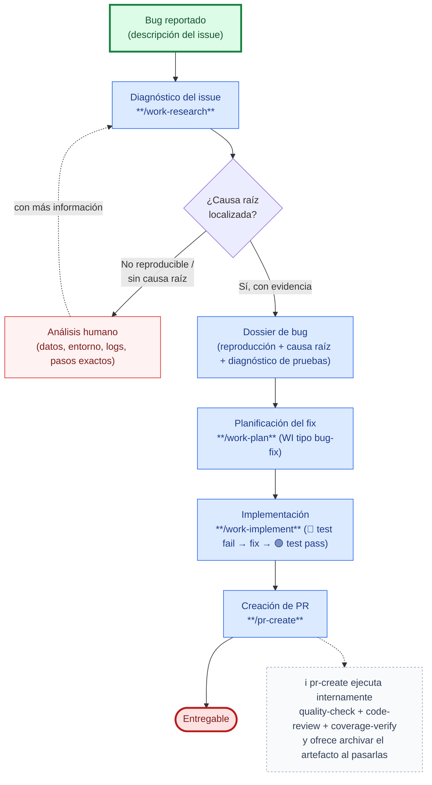

# Caso de uso: Fix a bug

Recorrido end-to-end para corregir un defecto reportado, usando SDD Devkit desde el diagnóstico hasta el entregable. Ver el flujo completo del skill en [work-research → Analizar issue](../../skills/work-research/references/issue/flow.md).

1. **Inicio**: alguien reporta un bug (descripción en texto o un work item en el gestor de proyectos).
2. **Diagnóstico** (`work-research`, flujo *Analizar issue*): reconstruye la reproducción, aísla la causa raíz y diagnostica en qué situación está la suite de pruebas frente al escenario.
3. **Condición — ¿causa raíz localizada con evidencia?**
   - **No** (bug no reproducible o sin causa raíz confirmada): el flujo no avanza a la remediación. Se entrega el diagnóstico parcial y pasa a **análisis humano**, que reúne lo que falta (datos, entorno, logs, versión, pasos exactos). Con esa información nueva, se puede reintentar el diagnóstico.
   - **Sí**: se produce el **dossier de bug** (reproducción, causa raíz, diagnóstico de pruebas y plan rojo→verde propuesto).
4. **Planificación** (`work-plan`): a partir del dossier, crea un `WI` de tipo `bug-fix` con el plan de implementación (un `IT-XX` por paso del ciclo rojo→verde) y sus criterios de aceptación.
5. **Implementación** (`work-implement`): ejecuta el ciclo en orden — 🔴 prueba que falla demostrando el bug, corrección mínima de la causa raíz, 🟢 prueba en verde.
6. **Cierre**: creación de Pull/Merge Request (`pr-create`) hacia el entregable. `pr-create` ejecuta **internamente** las puertas de calidad (`quality-check`, `code-review`, `coverage-verify`) antes de crear el PR y, pasadas todas, **pregunta si archivar el `WI-XXX`**; solo si el usuario confirma mueve su carpeta a `docs/archive/work-items/` (declinarlo no impide crear el PR) —junto con el `RS-XXX` del paso 2 si ningún otro artefacto activo lo referencia— para que el movimiento viaje dentro del PR. No son pasos aparte de este flujo.

## Cuándo no aplica este caso

| Situación | Camino correcto |
|-----------|------------------|
| El código hace lo especificado y lo especificado está mal | `work-define` (corregir la US/criterios), no un bug-fix |
| No hay comportamiento defectuoso, sino código legado sin documentar ni probar | [Cobertura de pruebas en código existente](test-coverage-legacy-code.md) |
| El «bug» es en realidad una carencia funcional | `work-define` (nueva US) o `work-plan` (WI de otro tipo) |
| Incidente en producción que requiere mitigación inmediata | Respuesta a incidentes; este caso entra después, para el fix definitivo |

Otras tareas de mantenimiento sin diagnóstico previo (deuda técnica, dependencias, seguridad, operativa): [Tarea de mantenimiento](maintenance-task.md).

Detalle completo del diagnóstico (matriz de situación de pruebas, plantilla del dossier, anti-patrones): [`skills/work-research/references/issue/flow.md`](../../skills/work-research/references/issue/flow.md).
