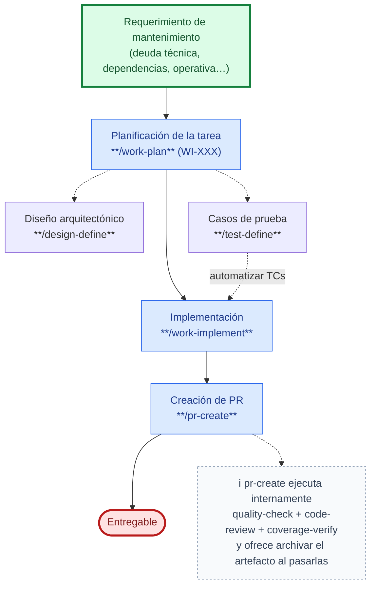

# Caso de uso: Tarea de mantenimiento

Recorrido end-to-end para un requerimiento de mantenimiento que **no** es ni un bug ni un refactor — deuda técnica, actualización de dependencias, optimización, actualización de seguridad, mejora de pruebas, actualización de documentación o tarea operativa — usando SDD Devkit. Es el mismo [flujo de implementación](../../README.md#flujo-de-implementación) del README, con una única diferencia: **no pasa por `work-define`**. Al no haber una historia de usuario asociada, la planificación (`work-plan`) arranca directamente desde el requerimiento.

> [Fix a bug](fix-a-bug.md) y [Refactorización de código](refactor.md) son los casos especializados para esos dos tipos — cada uno con su propio paso de investigación y su propia condición de entrada (causa raíz localizada, factibilidad). Lo que **distingue** a este caso de esos dos es justamente que el requerimiento de entrada no es un bug ni un refactor: cubre el resto de tipos de `WI` (`dependency-update`, `optimization`, `security-update`, `test-improvement`, `documentation-update`, `operational-change`), que no requieren esa investigación previa.

1. **Inicio**: un requerimiento de mantenimiento **que no es un bug ni un refactor** entra **directo a Planificación de tareas** (`work-plan`) — a diferencia del flujo con historia de usuario, no pasa por `work-define` porque no hay `US` asociada.
2. **Planificación** (`work-plan`): crea el `WI-XXX` eligiendo el `Tipo` según el requerimiento (`dependency-update` / `optimization` / `security-update` / `test-improvement` / `documentation-update` / `operational-change`).
3. Opcionalmente, durante la planificación se ajusta el diseño arquitectónico (`design-define`) y/o se definen casos de prueba (`test-define`) — igual que en el flujo con historia de usuario.
4. El `WI` en `Ready` pasa a **Implementación** (`work-implement`). Los casos de prueba definidos en el paso anterior también pueden automatizarse ahí.
5. **Cierre**: creación de Pull/Merge Request (`pr-create`) hacia el entregable. `pr-create` ejecuta **internamente** las puertas de calidad (`quality-check`, `code-review`, `coverage-verify`) antes de crear el PR y, pasadas todas, **pregunta si archivar el `WI-XXX`**; solo si el usuario confirma mueve su carpeta a `docs/archive/work-items/` (declinarlo no impide crear el PR) para que el movimiento viaje dentro del PR. No son pasos aparte de este flujo.

## Cuándo no aplica este caso

| Situación | Camino correcto |
|-----------|------------------|
| El requerimiento sí tiene (o necesita) una historia de usuario | [Flujo de implementación](../../README.md#flujo-de-implementación) completo, con `work-define` |
| Es una corrección de un defecto reportado | [Fix a bug](fix-a-bug.md) — investigación previa con diagnóstico de causa raíz |
| Es un refactor de código existente | [Refactorización de código](refactor.md) — investigación previa de factibilidad e impacto |
| La implementación la ejecuta un framework de terceros (Speckit, OpenSpec, AgentOS) | Variante [Integración con otros frameworks de implementación](../../README.md#integración-con-otros-frameworks-de-implementación) del README |

Definición de tareas de mantenimiento y sus tipos: [`skills/work-plan/references/maintenance-tasks.md`](../../skills/work-plan/references/maintenance-tasks.md).
