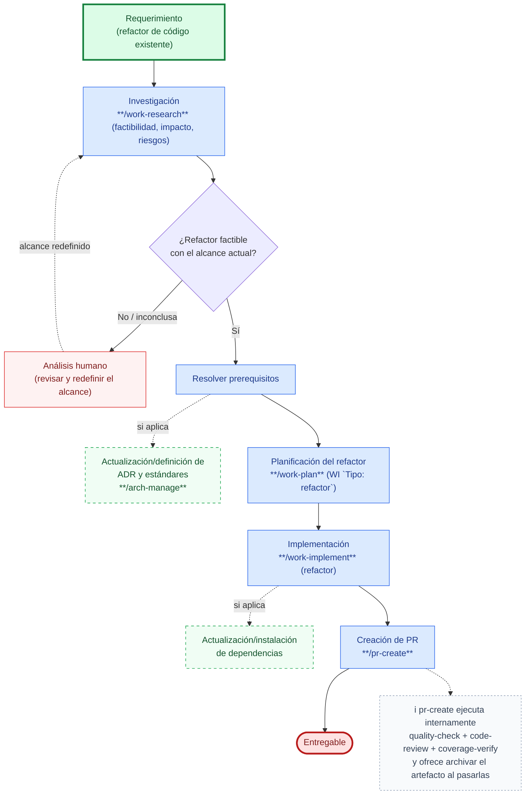

# Caso de uso: Refactorización de código

Recorrido end-to-end para refactorizar código existente, usando SDD Devkit desde la validación de factibilidad hasta el entregable. Ver el flujo completo del skill en [work-research → Investigación libre](../../skills/work-research/references/free/flow.md).

1. **Inicio**: un requerimiento de refactor (deuda técnica, acoplamiento, duplicación, patrón obsoleto) entra al flujo.
2. **Investigación** (`work-research`, flujo *Investigación libre*, dominio **Cambio**): valida la factibilidad del refactor y delimita la superficie de impacto (qué módulos, contratos y consumidores se ven afectados), riesgos, *breaking changes* y criterio de *rollback*. No produce plan de implementación — eso es `work-plan`.
3. **Condición — ¿el refactor es factible con el alcance actual?**
   - **No / inconclusa**: la investigación no cierra en una recomendación accionable (impacto demasiado amplio, riesgo no mitigable, falta información). Sale a **análisis humano**, que revisa y redefine el alcance (acotarlo, dividirlo, posponerlo) o reúne el contexto que falta. Con el alcance redefinido, el flujo **vuelve a la investigación** (`work-research`), no arranca desde cero.
   - **Sí**: pasa a **resolver prerequisitos** que la investigación haya identificado, antes de planificar el refactor en sí.
4. **Resolver prerequisitos** — rama **opcional**, que solo se resuelve si la investigación la señaló y no queda encadenada al resto del diagrama: **actualización/definición de ADR y estándares** (`arch-manage`), si el nuevo diseño formaliza una decisión arquitectónica o cambia un criterio de cumplimiento vigente.
5. **Planificación del refactor** (`work-plan`): WI `Tipo: refactor` con el cambio estructural en sí.
6. **Implementación** (`work-implement`): cambio estructural sin alterar comportamiento observable; suite en verde. Incluye, como tarea **opcional** dentro de la misma implementación (no encadenada al resto del diagrama), la **actualización/instalación de dependencias** (`work-plan` con WI `Tipo: dependency-update`) cuando el refactor solo es viable con versiones más nuevas de una o más dependencias (API removida, vulnerabilidad, incompatibilidad).
7. **Cierre**: creación de Pull/Merge Request (`pr-create`) hacia el entregable. `pr-create` ejecuta **internamente** las puertas de calidad (`quality-check`, `code-review` — SOLID, acoplamiento, duplicación — y `coverage-verify`) antes de crear el PR y, pasadas todas, **pregunta si archivar el `WI-XXX`**; solo si el usuario confirma mueve su carpeta a `docs/archive/work-items/` (declinarlo no impide crear el PR) para que el movimiento viaje dentro del PR. No son pasos aparte de este flujo.

## Cuándo no aplica este caso

| Situación | Camino correcto |
|-----------|------------------|
| El refactor es consecuencia de corregir un defecto concreto | [Fix a bug](fix-a-bug.md) — el refactor oportunista no se mezcla con el fix |
| No hay código que cambiar de forma, sino una capacidad nueva | `work-define` (nueva US) |
| El código no tiene requisitos ni pruebas documentados | [Cobertura de pruebas en código existente](test-coverage-legacy-code.md), antes de refactorizar a ciegas |
| Es solo una decisión estructural a registrar, sin refactor de código asociado | `arch-manage` (ADR) directamente, alimentado por la investigación de impacto — sin pasar por este flujo |
| Otras tareas de mantenimiento sin necesidad de validar factibilidad primero | [Tarea de mantenimiento](maintenance-task.md) |

Detalle completo del flujo de investigación (clasificación de dominio, qué produce cada uno, handoffs): [`skills/work-research/references/free/flow.md`](../../skills/work-research/references/free/flow.md). Definición de tareas de mantenimiento y sus tipos (`refactor`, `dependency-update`, …): [`skills/work-plan/references/maintenance-tasks.md`](../../skills/work-plan/references/maintenance-tasks.md).
