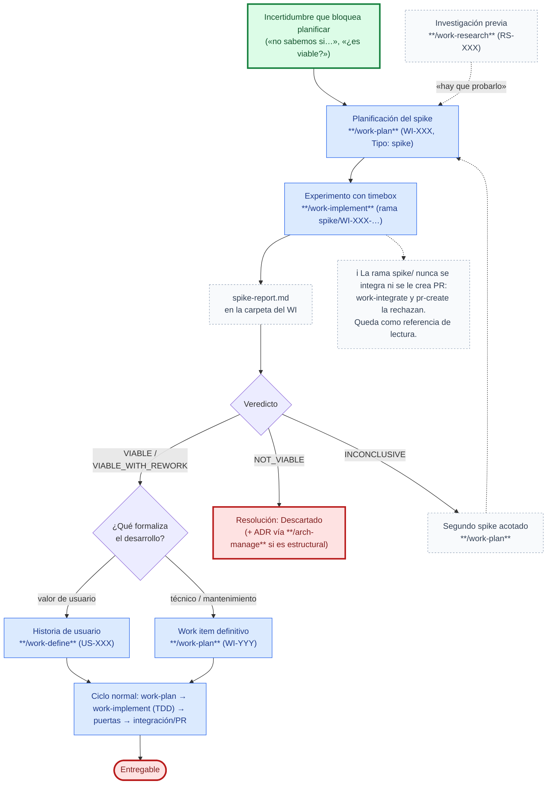

# Caso de uso: Spike (experimento antes de planificar)

Recorrido end-to-end para una **incertidumbre que impide planificar o estimar** —¿es viable esta tecnología?, ¿aguanta este enfoque la carga?, ¿cuánto cuesta realmente integrar X?— que solo se resuelve **construyendo o midiendo algo**, no leyendo. SDD Devkit la modela como un `WI-XXX` de **`Tipo: spike`**: un experimento con **timebox** cuyo entregable es un **informe** (`spike-report.md`), nunca código integrable. La rama del spike queda como referencia y el desarrollo definitivo se formaliza después en una historia de usuario o en otro work item, que se implementa **desde cero y con TDD**.

> Si la incertidumbre se resuelve **leyendo** (documentación, código existente, comparar opciones), el camino es [`work-research`](../../skills/work-research/SKILL.md), no un spike. Un `RS-XXX` que termina en «hay que probarlo» es la entrada natural de un spike.

1. **Inicio**: alguien plantea una incertidumbre que bloquea una decisión o una estimación. La primera compuerta es la misma que aplica `work-plan` para elegir tipo: si se puede responder leyendo, es `work-research`; si hay que construir o medir, es un spike.
2. **Planificación** (`work-plan`): crea el `WI-XXX` con `Tipo: spike` usando `work-item-spike-template.md`. La entrevista cierra la **pregunta de investigación** (una), la **hipótesis**, las **preguntas a responder** (`Q-XX`, cada una con criterio de **éxito** y de **fallo** medibles), el **timebox**, el **enfoque** del experimento (`IT-XX`) y el artefacto que espera el resultado (`Origen`). No hay `AC-XXX`, ni plan de implementación, ni `test-define`. `Ready` exige timebox y al menos una `Q-XX` medible.
3. **Experimento** (`work-implement`): rama `spike/WI-XXX-[slug]`, sin TDD obligatorio, con **evidencia obligatoria** por `Q-XX` en `assets/` del WI. El timebox es una condición de parada dura: al agotarse, lo pendiente queda `INCONCLUSIVE`. Al terminar redacta **`spike-report.md` en la misma carpeta del WI** (resultados por `Q-XX`, veredicto con marca oculta `spike:verdict`, diagnóstico, consideraciones para la implementación definitiva o sustento del descarte, qué reutilizar de la rama) y commitea en la rama `spike/`.
4. **Cierre por formalización, nunca por integración**: según el veredicto, `work-implement` ofrece crear la **historia de usuario** (`work-define`, si el resultado entrega valor de usuario) o el **work item definitivo** (`work-plan`, si es técnico), descartar (`Resolución: Descartado`, con ADR si la decisión es estructural) o planificar un **segundo spike** más acotado. El artefacto definitivo cita `Origen: WI-XXX (spike)`, enlaza el informe y la rama como referencia de lectura, deriva sus `AC-XXX` de las `Q-XX` validadas y hereda a Observaciones las decisiones que el informe dejó abiertas; al crearlo se actualiza la `Resolución` del spike.
5. **Implementación definitiva**: ciclo normal —`work-plan` → `work-implement` con TDD → puertas → `work-integrate`/`pr-create`— consultando la rama del spike como referencia, nunca mergeándola. Cuando el equipo termine su revisión, el spike se archiva con `/work-plan WI-XXX archive` (cuenta como completo si tiene informe y `Resolución` distinta de `Abierto`); el informe viaja con la carpeta.

## Cuándo no aplica este caso

| Situación | Camino correcto |
|-----------|------------------|
| La duda se resuelve leyendo documentación, código u opciones | [`work-research`](../../skills/work-research/SKILL.md) — investigación libre o decisiones pendientes |
| Ya se sabe qué hacer y solo falta planificarlo | [Tarea de mantenimiento](maintenance-task.md) o historia de usuario con `work-define` |
| El código del experimento «se quiere integrar tal cual» | No es un spike: es un `WI` implementable con `AC-XXX` y puertas de calidad. Si ya se hizo como spike, se formaliza como WI definitivo y se reimplementa con TDD |
| Es una decisión arquitectónica que ya tiene opciones claras | ADR con [`arch-manage`](../../skills/arch-manage/SKILL.md) |

Definición del tipo y sus reglas: [`skills/work-plan/references/maintenance-tasks.md`](../../skills/work-plan/references/maintenance-tasks.md#variante-tipo-spike-experimento-acotado) · ejecución: [`skills/work-implement/references/work-items.md`](../../skills/work-implement/references/work-items.md#variante-tipo-spike-experimento-sin-integracion) · formalización en historia: [`skills/work-define/references/flow.md`](../../skills/work-define/references/flow.md#flujo-formalizar-el-resultado-de-un-spike-en-una-historia).
