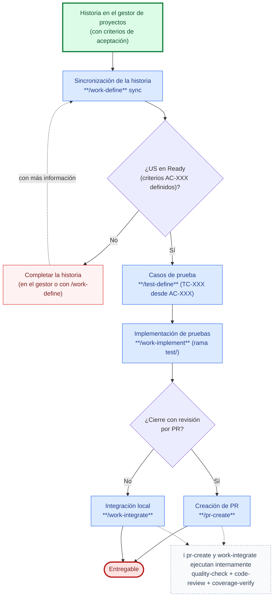

# Caso de uso: Automatización de pruebas desde historias de usuario

Recorrido end-to-end para crear pruebas automatizadas de una historia de usuario que vive en el gestor de proyectos, usando SDD Devkit desde la sincronización de la historia hasta el entregable. La funcionalidad bajo prueba **ya está implementada**: este flujo entrega pruebas, no funcionalidad nueva.

1. **Inicio**: una historia de usuario que existe en el gestor de proyectos (`projectManagement` en `.sdd-devkit/settings.json`), con su descripción y criterios de aceptación, cuya funcionalidad ya está implementada.
2. **Sincronización de la historia** (`work-define`): con `sync #id` trae una historia que no existe en local, o actualiza una que ya existe mostrando el diff por sección y aplicando solo lo confirmado. Mapea los campos del work item a la plantilla, codifica los criterios como `AC-XXX` (inmutables una vez asignados) y **nunca escribe en el gestor**: la dirección es únicamente gestor → repositorio. Un `#id` sin modificador no importa nada: el skill pregunta.
3. **Condición — ¿US en `Ready`?**
   - **No** (criterios ausentes, ambiguos o sin resolver): no se definen casos de prueba todavía. Se completa la historia en el gestor o con `work-define`, y se repite la sincronización.
   - **Sí**: se continúa con los casos de prueba.
4. **Casos de prueba** (`test-define`): por cada `AC-XXX` genera los `TC-XXX` desde varios ángulos (camino esperado, error, límites — el que aplique) según IEEE 29119-4, y marca cada uno como manual o automatizable. Se guardan junto a la historia (`<changesPath>/user-stories/US-XXX-{slug}/test-cases/`), con un índice que registra el `Estado` de cada caso.
5. **Implementación de pruebas** (`work-implement`, tipo **caso de prueba**): crea la rama `test/US-XXX-{slug}` y **traduce a código cada `TC-XXX` en `Ready` y automatizable**, 1:1 y sin inventar casos; los manuales se registran en `progress.md` con el motivo. Una prueba que falla no se relaja: se detiene y se presenta la evidencia para decidir entre corregir la prueba, corregir producción (correctivo puntual con decisión explícita del usuario) o volver a `test-define`. Si un `TC-XXX` es ambiguo o un `AC-XXX` quedó sin casos, el control vuelve a `test-define`.
6. **Cierre**: una de dos salidas, ambas con las mismas puertas de calidad como bloqueantes — `quality-check` (tipado, linter, suites y cobertura), `code-review` (calidad de las pruebas escritas, no su ejecución) y `coverage-verify` (cada `AC-XXX` ↔ sus `TC-XXX` ↔ pruebas, con `criteria-coverage.md`). No son pasos aparte de este flujo. Un fallo se devuelve a `work-implement` en modo corrección.
   - **Con revisión por PR** (`pr-create`): detecta la plataforma (GitHub, GitLab, Bitbucket, Gitea, Azure Repos) y abre el PR desde `test/US-XXX-{slug}` hacia la rama de integración.
   - **Sin PR** (`work-integrate`): verifica que las unidades de `progress.md` estén en `Done` y hace `git merge --no-ff` hacia la rama de origen. No hace push ni crea PR.

   **Aquí no hay archivado:** la rama es `test/` sobre una `US-XXX`, y una rama `test/` cierra casos de prueba, no la historia que los originó.

## Cuándo no aplica este caso

| Situación | Camino correcto |
|-----------|------------------|
| La integración con el gestor de proyectos no está activa | `sync` no está disponible: redactar la historia con `work-define` y continuar desde el paso 4 |
| La historia ya está redactada en local y solo faltan las pruebas | `test-define` directamente sobre esa US, sin pasar por `sync` |
| Un criterio cambió en el gestor después de definir los casos | `sync US-XXX` y luego `test-define` para ajustar los `TC-XXX` afectados (los marca `Draft` u `Obsolete`) |
| La historia aún no está implementada | Planificar e implementar primero con `work-plan` + `work-implement` (tareas `TK-XXX`, con sus pruebas en TDD); este flujo solo automatiza sobre código existente |
| El código no tiene requisitos escritos, ni historia en el gestor | [Cobertura de pruebas en código existente](test-coverage-legacy-code.md) |
| Una prueba fiel al `TC-XXX` revela un defecto real | [Fix a bug](fix-a-bug.md), tras diagnosticarlo con `work-research` (flujo *Analizar issue*) |
| La historia está archivada en `<archivedPath>/` | El trabajo está cerrado: desarchivarla antes de definir casos o escribir dentro de ella |

Detalle de la sincronización (`sync`): [`skills/work-define/references/flow.md`](../../skills/work-define/references/flow.md#flujo-sincronizar-una-historia-desde-el-gestor-de-proyectos-sync). Detalle del tipo caso de prueba de `work-implement` (solo pruebas, nunca funcionalidad nueva): [`skills/work-implement/references/test-cases.md`](../../skills/work-implement/references/test-cases.md).
