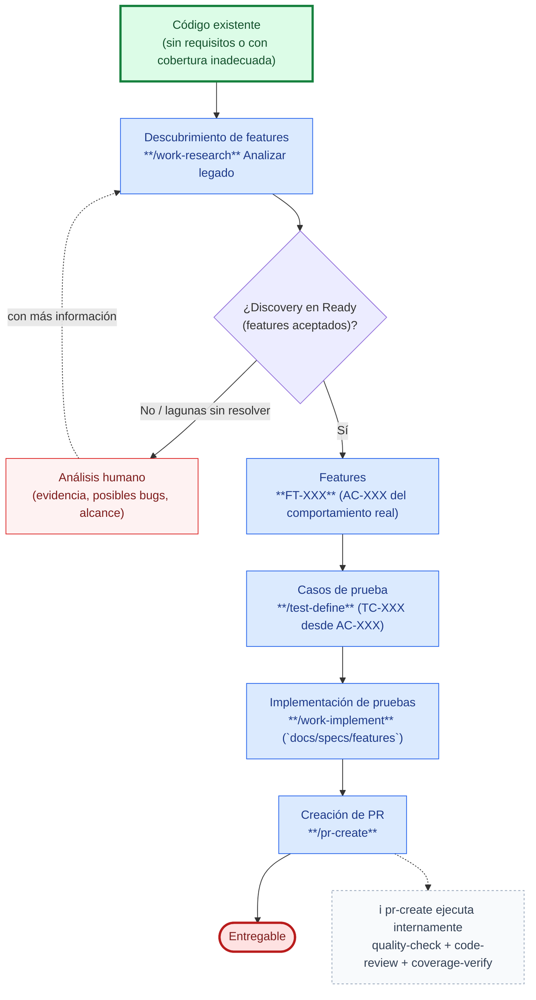

# Caso de uso: Cobertura de pruebas en código existente

Recorrido end-to-end para cubrir con pruebas código ya implementado y sin requisitos escritos (o con cobertura inadecuada), usando SDD Devkit desde el descubrimiento por ingeniería inversa hasta el entregable. Ver el flujo completo del skill en [work-research → Analizar legado](../../skills/work-research/references/legacy/flow.md).

1. **Inicio**: un módulo, carpeta o repo con código ya implementado, sin requisitos escritos o con cobertura de pruebas inadecuada.
2. **Descubrimiento** (`work-research`, flujo *Analizar legado*): reconstruye por ingeniería inversa el comportamiento del código — artefactos técnicos → casos de uso → capabilities → features → cohesión → reglas de negocio — y produce el `discovery.md`.
3. **Condición — ¿discovery en `Ready`?**
   - **No** (lagunas: evidencia `⚠️ Sin evidencia`, features sin veredicto Aceptado, posibles bugs sin decisión): el flujo no crea features todavía. Pasa a **análisis humano**, que resuelve las lagunas o decide si un comportamiento dudoso se preserva o se trata como bug. Con esa información, se reintenta el discovery.
   - **Sí**: se crean los **Features** (`FT-XXX`) aceptados, con sus `AC-XXX` redactando el comportamiento **real** del código (nunca el deseado).
4. **Casos de prueba** (`test-define`): por cada `FT-XXX` en `Ready`, genera los `TC-XXX` a partir de sus `AC-XXX`, guardados dentro de la propia carpeta del feature (`docs/specs/features/FT-XXX-{slug}/test-cases/`).
5. **Implementación de pruebas** (`work-implement`, tipo **feature**, sobre `docs/specs/features`): **automatiza los `TC-XXX` documentados** de los `FT-XXX` — nunca escribe funcionalidad nueva. El código de producción solo se toca de forma correctiva y con decisión explícita del usuario. Si al automatizar aparece una discrepancia real entre el `TC-XXX` y el código (un posible bug), se detiene y se escala a `test-define` o al diagnóstico vía `work-research`.
6. **Cierre**: creación de Pull/Merge Request (`pr-create`) hacia el entregable. `pr-create` ejecuta **internamente** `quality-check`, `code-review` (calidad de las pruebas escritas, no su ejecución) y `coverage-verify` (cobertura funcional: cada `AC-XXX` del feature ↔ sus `TC-XXX` ↔ artefactos de prueba) — no son pasos aparte de este flujo. **Aquí no hay archivado:** la rama es `test/` sobre un `FT-XXX`, y un feature no se archiva — la automatización cierra una ejecución, no el artefacto.

## Cuándo no aplica este caso

| Situación | Camino correcto |
|-----------|------------------|
| El código tiene un defecto real, no solo falta de pruebas | [Fix a bug](fix-a-bug.md), tras diagnosticarlo con `work-research` (flujo *Analizar issue*) |
| El código ya tiene requisitos documentados (`US-XXX`/`WI-XXX`) pero sin pruebas | `test-define` directamente sobre esa US/WI, sin pasar por `work-research` |
| Se busca escribir funcionalidad nueva, no cubrir la ya existente | `work-define` (nueva US) o `work-plan` (WI de otro tipo) — un `FT-XXX` nunca produce código funcional |
| Solo se quiere el diagnóstico del código legado, sin automatizar pruebas | `work-research` (flujo *Analizar legado*) hasta el discovery/features, sin invocar `test-define` ni `work-implement` |
| Se quiere refactorizar el código, no solo cubrirlo | [Refactorización de código](refactor.md) — conviene cubrir primero con este caso antes de refactorizar a ciegas |

Detalle completo del descubrimiento (cascada obligatoria, plantillas, anti-patrones): [`skills/work-research/references/legacy/flow.md`](../../skills/work-research/references/legacy/flow.md). Detalle del tipo feature de `work-implement` (solo pruebas, nunca funcionalidad nueva): [`skills/work-implement/SKILL.md`](../../skills/work-implement/SKILL.md).
