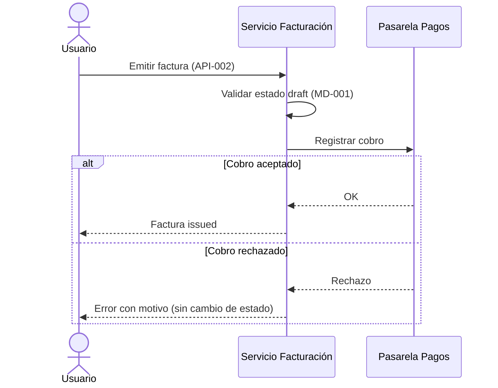
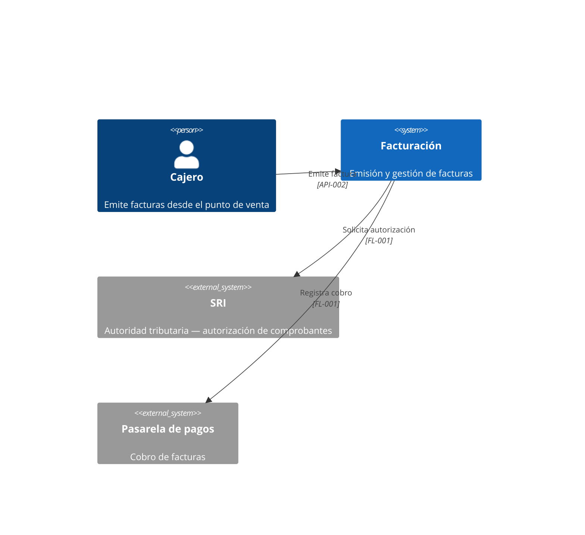

# Estándares de definición por tipo de elemento

Cómo se define cada tipo de elemento de una capability. La estructura exacta de secciones y tablas está en las plantillas de `assets/` (`capability-readme-template.md` para el README con las APIs; `model-template.md`, `flow-template.md` y `diagram-template.md` para los archivos de `models/`, `flows/` y `diagrams/`); este archivo explica las reglas, los criterios de calidad y da un ejemplo completo por tipo.

Reglas comunes a todos los tipos:

- **Id estable por tipo:** `MD-XXX`, `API-XXX`, `FL-XXX`, `DG-XXX`, secuencial dentro de la capability (la secuencia es única aunque los elementos vivan en archivos distintos). No renumerar nunca: otros artefactos enlazan por ancla o por nombre de archivo. Si un elemento deja de aplicar, marcarlo `(Obsoleto)` en el título y explicar en qué fue reemplazado, en lugar de borrarlo, mientras existan consumidores que lo referencien.
- **Dónde vive cada tipo:** las APIs (`API-XXX`) en el `README.md` de la capability; cada modelo (`MD-XXX`), cada flujo (`FL-XXX`) y cada diagrama (`DG-XXX`) en su propio archivo bajo `models/`, `flows/` y `diagrams/`, **nombrado con el estándar `MD-XXX-{slug}` / `FL-XXX-{slug}` / `DG-XXX-{slug}`** (`models/MD-001-factura.md`, `flows/FL-001-emision-factura.md`, `diagrams/DG-001-contexto.md`; slug kebab-case del nombre, fijado al crear el elemento) y enlazado desde la tabla índice correspondiente del README. Renombrar el elemento no renombra el archivo: el id es el contrato, igual que en las carpetas `US-XXX-[nombre-corto]`. Su referencia externa es la ruta del archivo, sin ancla.
- **Ancla explícita, igual al id en minúsculas** (elementos del README). Cada API lleva **inmediatamente antes** de su encabezado una línea con su ancla, y el encabezado sigue siendo `### ID: Nombre`:

  ```markdown
  <a id="api-001"></a>
  ### API-001: Crear factura
  ```

  El ancla es **solo el id** (`#api-004`), sin el nombre. Junto con las rutas de archivo de `models/`/`flows/`/`diagrams/`, es la única referencia que consumen US/TK/WI. **No es opcional ni cosmética:** ver [Por qué el ancla no se deriva del título](#por-qué-el-ancla-no-se-deriva-del-título).
- **Referencias cruzadas por id:** cuando un elemento usa otro (una API recibe un modelo, un flujo invoca una API), citarlo por su id (`MD-001`, `API-002`) con la ruta relativa desde el archivo donde se cita — desde el README a un modelo, `[MD-001](models/MD-001-factura.md)`; entre elementos del README, ancla local (`[API-002](#api-002)`); desde un archivo de `models/` al README, `[API-001](../README.md#api-001)`; entre capabilities, ruta relativa (`[MD-001 de facturación](../facturacion/models/MD-001-factura.md)` o `[API-001 de facturación](../facturacion/README.md#api-001)`).
- **No inventar:** todo tipo, código de error, regla o rama de flujo que no venga del input, del código del repo o de la US/TK/WI de origen se pregunta (grilling) o queda en Observaciones. Un dato plausible pero no confirmado es peor que una laguna documentada.
- **Idioma de los identificadores** (detalle de la excepción declarada en la sección «Resolución de idioma» de `SKILL.md`): los nombres de campos, rutas y payloads se escriben como existirán en el código. Resolver así, deteniéndose en el primer paso que aplique:
  1. Si ya existen modelos/DTOs/endpoints en el repo (código o documentos técnicos previos), seguir **su** convención de idioma tal cual está, aunque sea español — no imponer inglés sobre un código que ya usa español.
  2. Si es el primer elemento técnico del proyecto (sin precedente en el repo) y el idioma no es evidente del contexto, **preguntarlo explícitamente** en el grilling inicial (p. ej. «¿los nombres de campo van en español o en inglés?») en vez de asumir inglés por defecto — es una decisión recurrente en proyectos hispanohablantes y asumirla sin preguntar genera documentos inconsistentes con lo que el equipo termina escribiendo.
  3. Sin precedente y sin poder preguntar (ver "Sin canal de respuesta disponible" en `flow.md`): usar inglés como default y dejar constancia en Observaciones de que la convención de idioma de campos quedó asumida, no confirmada.

  Las descripciones (prosa) van siempre en el idioma de preferencia resuelto para el documento, sin importar el idioma elegido para los nombres de campo.

---

## Por qué el ancla no se deriva del título

El ancla que un renderizador genera solo desde `### API-001: Crear factura` **no sirve como contrato de enlace**, por tres motivos independientes:

1. **El consumidor no la puede construir.** Quien escribe la referencia —`work-define` o `work-plan` redactando la sección Referencias de una US/TK/WI— conoce el **id**, no el slug del nombre. Tiene que adivinarlo, y cualquier fallo produce un enlace que apunta a nada. Es el fallo más frecuente de esta convención.
2. **Depende del renderizador.** Los slugs derivados **no** están estandarizados. `### API-003: Aprobación de crédito` genera `#api-003-aprobacion-de-credito` en unos motores (que transliteran la tilde) y `#api-003-aprobación-de-crédito` en otros (que la conservan). El mismo documento, dos anclas distintas según dónde se lea: el enlace funciona en la web del repo y falla en el editor, o al revés. La puntuación agrava lo mismo — `API-002: Emitir factura (SRI/ATS)` colapsa a `#api-002-emitir-factura-sriats`, imposible de anticipar.
3. **Rompe al renombrar.** El id es estable por diseño; el nombre no. Corregir «Crear factura» por «Emitir factura» invalidaría **todos** los enlaces entrantes, que es justo lo que la estabilidad del id pretendía evitar.

El ancla explícita `<a id="api-001"></a>` resuelve los tres: es derivable del id (`API-001` → `#api-001`), idéntica en cualquier renderizador porque no se calcula, y sobrevive a cualquier cambio de nombre. `<a id>` es HTML admitido por GitHub, GitLab, Bitbucket y Azure Repos; **no** usar la sintaxis `{#api-001}` de kramdown/pandoc, que GitHub no interpreta y deja visible como texto dentro del título. Los archivos de `models/`, `flows/` y `diagrams/` aplican la misma doctrina en su parte estable: el id manda y el slug se congela al crear — `MD-001-factura.md` no se renombra aunque el modelo pase a llamarse «Factura de venta», y nunca es solo `factura.md`.

> El ancla derivada del título sigue existiendo, no se pierde nada. Pero la **referencia canónica es la explícita**, y es la única que se cita.

---

## Modelos de datos (MD-XXX)

Un `MD-XXX` describe una entidad, DTO o esquema: su tabla de campos, validaciones y relaciones.

Reglas:

- **Tipos concretos**, no genéricos: `string (UUID v4)`, `decimal(12,2)`, `date (ISO 8601)` — no «texto» ni «número». Si el proyecto tiene tipos propios o enums, citarlos por nombre y listar los valores permitidos en Validaciones.
- **Validaciones verificables:** rangos, formatos (regex si aplica), unicidad, obligatoriedad condicional («requerido si `type = credit`»). Es la columna que las TK y los test cases consumen; una validación vaga («debe ser válido») no sirve.
- **Relaciones explícitas** con cardinalidad: `Factura 1—N LineaFactura (MD-002)`. Incluir diagrama `erDiagram` de Mermaid solo cuando hay dos o más modelos relacionados; con un modelo aislado el diagrama no aporta.
- Distinguir en la descripción si el modelo es **entidad persistida**, **DTO de transporte** o **proyección/vista**, porque condiciona qué validaciones aplican y dónde.

**Ejemplo:**

Archivo `models/MD-001-factura.md`:

# MD-001: Factura

Entidad persistida que representa una factura emitida a un cliente.

| Campo | Tipo | Requerido | Descripción | Validaciones / restricciones |
| ----- | ---- | --------- | ----------- | ---------------------------- |
| id | string (UUID v4) | Sí | Identificador único | Generado por el sistema; inmutable |
| customerId | string (UUID v4) | Sí | Cliente facturado | Debe existir en la capability clientes |
| status | enum | Sí | Estado de la factura | `draft` \| `issued` \| `paid` \| `voided` |
| total | decimal(12,2) | Sí | Total con impuestos | ≥ 0; suma de líneas + impuestos |
| issuedAt | datetime (ISO 8601, UTC) | No | Fecha de emisión | Requerido si `status ≠ draft` |

**Relaciones:** Factura 1—N LineaFactura (`[MD-002](MD-002-linea-factura.md)`)

---

## APIs / Endpoints (API-XXX)

Un `API-XXX` es el contrato de una operación: método+ruta, autenticación, request, responses y ejemplos.

Reglas:

- **Una operación por elemento.** `POST /invoices` y `GET /invoices/{id}` son dos `API-XXX` distintos, cada uno enlazable por separado.
- **Request y response tipados contra los modelos:** si el body es un modelo ya definido, referenciar `MD-XXX` en lugar de repetir la tabla de campos; definir inline solo lo que no exista como modelo (y valorar promoverlo a `MD-XXX` si lo consume más de una operación).
- **Responses exhaustivas:** el caso de éxito y **cada** error esperable con su código y condición (validación 400/422, autorización 401/403, no encontrado 404, conflicto 409…). Usar la estructura de error estándar del proyecto si existe; si no existe, preguntarla — no inventarla.
- **Ejemplos JSON realistas** para éxito y al menos un error, con valores coherentes con las validaciones de los `MD-XXX`.
- **Autenticación y permisos** siempre declarados, aunque sea «Pública»: la omisión es ambigua.

**Ejemplo:**

<a id="api-001"></a>
### API-001: Crear factura

- **Método y ruta:** `POST /api/v1/invoices`
- **Autenticación:** Bearer JWT; rol `billing:write`
- **Descripción:** Crea una factura en estado `draft` a partir de sus líneas.

**Request**

| Parámetro | Ubicación | Tipo | Requerido | Descripción |
| --------- | --------- | ---- | --------- | ----------- |
| customerId | body | string (UUID v4) | Sí | Cliente a facturar |
| lines | body | LineaFactura[] (MD-002) | Sí | Mínimo 1 línea |

```json
{ "customerId": "3fa85f64-5717-4562-b3fc-2c963f66afa6", "lines": [{ "productId": "…", "quantity": 2 }] }
```

**Responses**

| Código | Condición | Cuerpo |
| ------ | --------- | ------ |
| 201 | Factura creada | Factura (MD-001) |
| 422 | `lines` vacío o cliente inexistente | Error estándar del proyecto |
| 403 | Sin rol `billing:write` | Error estándar del proyecto |

---

## Flujos / Procesos (FL-XXX)

Un `FL-XXX` describe un proceso de negocio o técnico: disparador, participantes, pasos, diagrama y manejo de errores. Vive en su propio archivo (`flows/FL-XXX-{slug}.md`, plantilla `flow-template.md`), con su fila en la tabla índice del README.

Reglas:

- **Disparador y resultado siempre explícitos:** un flujo sin estado final verificable no es implementable ni testeable.
- **Diagrama Mermaid obligatorio.** Elegir el tipo por la naturaleza del flujo: `sequenceDiagram` cuando importa la interacción entre componentes/sistemas; `flowchart` cuando importan decisiones y ramas. Uno solo, el que mejor comunique — no ambos por defecto.
- **Pasos numerados con actor/componente explícito** en cada paso («El servicio de facturación valida…», no «se valida…»). Los pasos que invocan una API o tocan un modelo citan su id (`API-001`, `MD-001`).
- **Cada rama del diagrama aparece en los pasos o en Manejo de errores.** Un rombo del flowchart sin rama documentada es una laguna: preguntarla o registrarla en Observaciones.
- **Manejo de errores por paso:** qué puede fallar y el comportamiento esperado (reintento, compensación, mensaje al usuario, aborto). Es la parte que más lagunas suele tener — foco del grilling.

**Ejemplo (diagrama):**



---

## Diagramas (DG-XXX)

Un `DG-XXX` es un diagrama estructural o de arquitectura de la capability: clases, contexto (C4 nivel 1), contenedores (C4 nivel 2), componentes (C4 nivel 3), despliegue o estados. Se diferencia de los diagramas embebidos en otros elementos (el ER de un `MD-XXX`, la secuencia de un `FL-XXX`): un `DG-XXX` es un elemento **propio y enlazable**, con valor de referencia por sí mismo.

Reglas:

- **Tipo y alcance siempre declarados.** El tipo determina la notación; el alcance evita diagramas «de todo» que no responden ninguna pregunta concreta. Un buen `DG-XXX` responde una pregunta de implementación: ¿qué clases forman el dominio?, ¿con qué sistemas se integra la capability?, ¿en qué contenedores corre?
- **Mermaid como notación por defecto:** `classDiagram` para clases, `C4Context`/`C4Container`/`C4Component` para los niveles C4, `stateDiagram-v2` para estados, `flowchart` para despliegue si `C4Deployment` no aporta. Si el diagrama existe como archivo exportado (draw.io, PlantUML renderizado, imagen), guardarlo en `docs/architecture/[capability]/assets/` y enlazarlo desde el archivo del elemento — pero preferir Mermaid porque vive en el propio archivo y se versiona con él.
- **Nivel de detalle por tipo:** en clases, atributos y relaciones con cardinalidad, métodos solo si son parte del contrato del dominio; en contexto, sistemas externos y actores con la dirección de cada interacción; en contenedores/componentes, tecnología entre corchetes y el protocolo de cada flecha. Una flecha sin etiqueta es una laguna.
- **Coherencia con los demás elementos:** las clases del `DG-XXX` de clases deben corresponderse con los `MD-XXX` (citarlos en Notas); las interacciones del contexto con las `API-XXX` o `FL-XXX` que las materializan. Un diagrama que contradice las tablas es peor que ningún diagrama — al actualizar un `MD-XXX`/`API-XXX`/`FL-XXX`, revisar los `DG-XXX` que los citan.
- **Un diagrama por elemento.** Si hacen falta el contexto y los contenedores, son `DG-001` y `DG-002`, cada uno enlazable por separado.

**Ejemplo:**

Archivo `diagrams/DG-001-contexto.md`:

# DG-001: Contexto de la capability facturación

- **Tipo:** Contexto (C4)
- **Alcance:** sistemas y actores que interactúan con facturación; no incluye el detalle interno de los servicios.



**Notas**

- La interacción con la pasarela se detalla en `[FL-001](../flows/FL-001-emision-factura.md)`; el contrato de emisión en `[API-002](../README.md#api-002)`.

---

## ¿Y lo que no encaja en estos cuatro tipos?

Eventos de dominio, colas, jobs programados o integraciones con terceros pueden documentarse como el tipo más cercano (un contrato de evento suele caber como `MD-XXX` de payload + `FL-XXX` de proceso). Si el proyecto necesita un tipo propio con frecuencia, proponer al usuario extender esta convención — no improvisar formatos distintos en cada documento.
